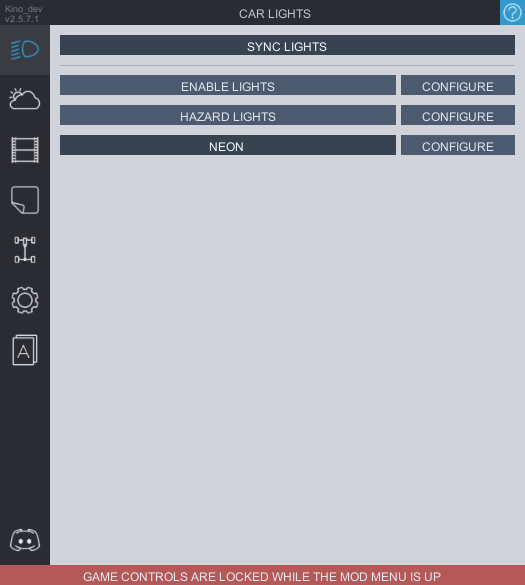

# Car Lights
Tab with setting for your headlights and tail lights. From here you can add lights to your car, cars of other players in the lobby and change their settings.
Lights are pre-configured for all the cars, however depending on the bodykit you might want to change the position settings for a better fit. Light settings are synced between players who have the mod.

**`SYNC LIGHTS`** button toggles the light synchronization. This only affect whether or not you will see other players enabling/disabling their lights. Color and and brightness are always synchronized between players with the mod.

**`HAZARD LIGHTS`** enables the hazards. They are pre-configured for all the cars, but you can change their position to better fit the bodykit. You can adjust how quick they blink as well.

**`HEAD LIGHTS COLOR`** opens the small window where you can adjust the color of your lights

**`ANGLE`** Adjusts the angle of your lights. It is recommended to keep this setting at 120 for the best look, but you can adjust this if you want.

**`HEADLIGHTS BRIGHTNESS`** Allows you to change the brightness of your lights, CarX default value is 20000, however it is recommended to keep it at 10000 for the more realistic look.

<b>Since the module replaces the CarX lights, it has certain issues. The light have a conflict with Goats maploader and might disappear on maps with lots of lighting (however from personal testing there's no deffinite cause and sometimes they work just fine). Either way if you're having issues, you can disable lights module from the SETTINGS tab (only works while you're in the garage)
</b>