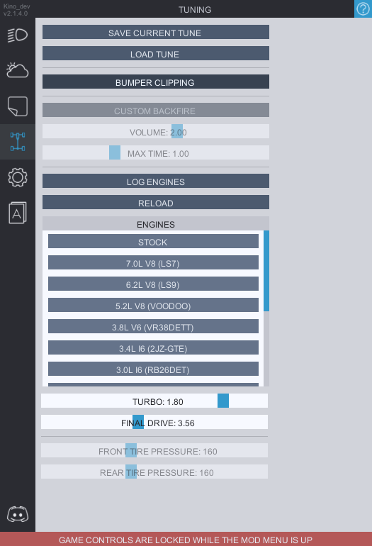

# Tuning
**`SAVE CURRENT TUNE`** Allows to save the tune you currently have on the car.   
The file will be saved to `CarX Drift Racing Online\BepInEx\plugins\KN_Base\tunes`  
**`LOAD TUNE`** opens the list with the tunes you have in your folder. And applies the tune you choose from the list.

Make sure to backup your tune before loading a different one otherwise you might loose it

**`CUSTOM BACKFIRE`** (enabled by default) adds a custom backfire to your exhaust. You can adjust the ***sound volume*** and the ***duration time*** with **`VOLUME`** and **`MAX TIME`** sliders.

<b>FOR NOW ENGINE SWAPS ARE STILL IN DEVELOPMENT AND ARE A ONLY AVAILABLE AS A PART OF THE <i>EXTRAS</i> MODULE FOR OUR SUPPORTERS. IF YOU DON'T HAVE THE ACCESS TO EXTRAS THIS TAB WILL ONLY HAVE THE CUSTOM BACKFIRE SETTINGS AT THE MOMENT</b>

Keep in mind that you can only apply them from the garage. Since they don't work with the dyno you have options to adjust turbo and final drive from the menu. Both are saved per every engine and the car.

If you have the **Extras** you will also be able to change the tire pressure on the go from this tab.
